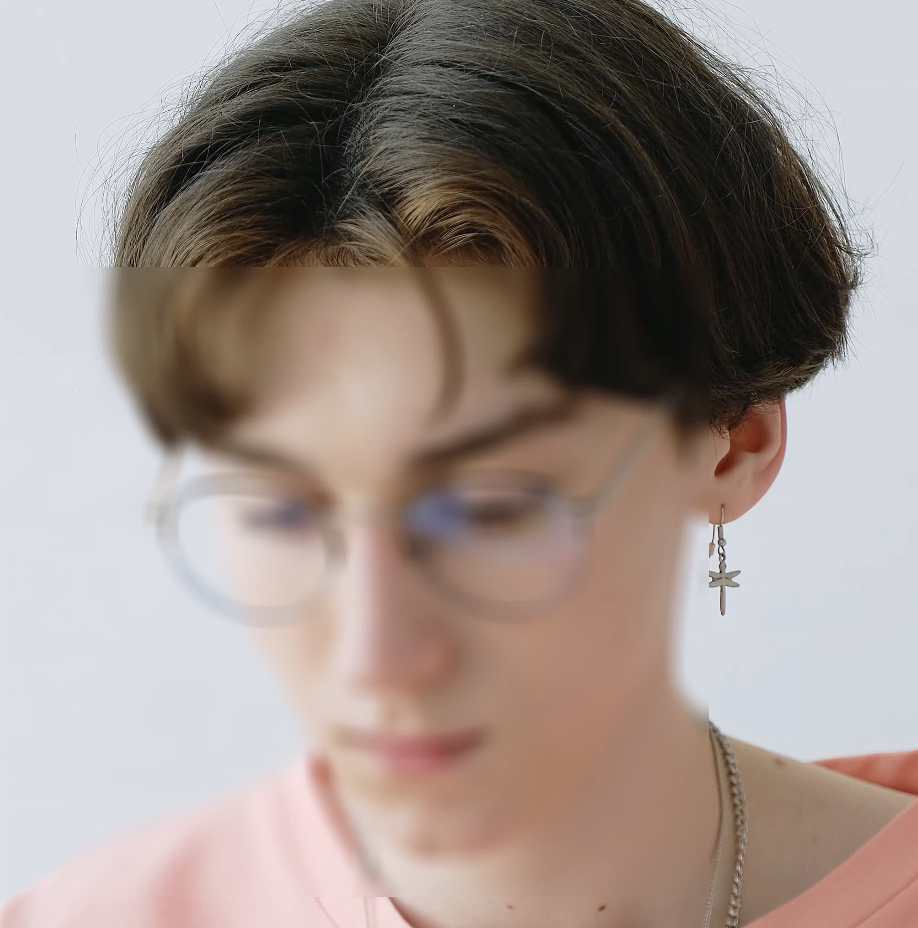

# face-censoring-tool
Tool using opencv-python package to blur faces. Will take video input .mp4 and output a video that blurs faces.

1. pip install opencv-python
2. python3 main.py
3. output will be called 'output_censored.mp4'

The 'video_sample.mp4' file will take about 2 minutes to complete processing.

